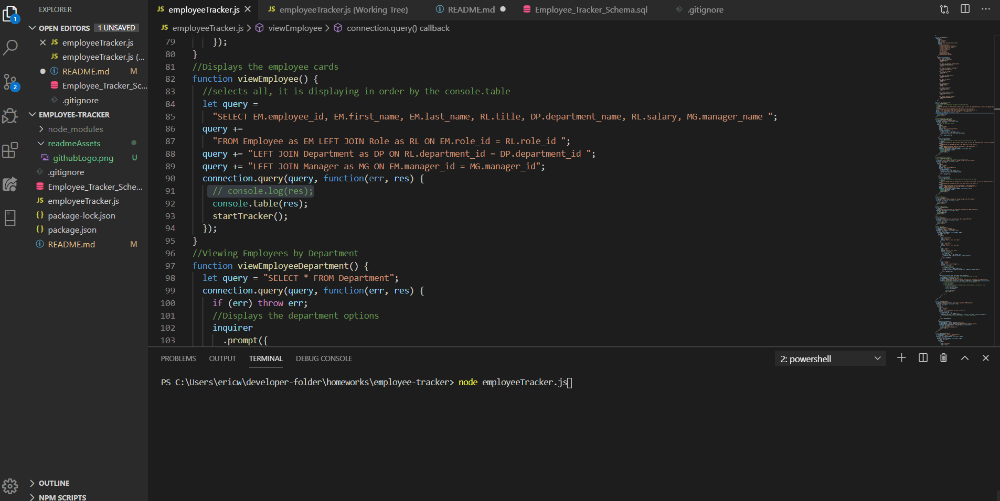

# Employee-Tracker
 <strong>GitHub Link</strong>   
Employee Tracker is a CLA (command-line application) that helps employers create, view, delete, or update current employees.   

# Requirements

My SQL   
<a href = "https://nodejs.org/en/">Node JS</a>
(Node Js didn't have an available image)

# Usage

<ol>
    <li>Before Starting everything, make sure you have the requirements listed above.</li>
    <li>Open Employee_Tracker_Schema.sql, copy the whole documents content.</li>
    <li>Inside My SQL program start a new query tab and paste what was copied from Employee_Tracker_Schema.sql and click the run (Lightning bolt)</li>
    <li>Inside your code editor of choice, depending on what is your My SQL password you might have to change line 10 in employee.Tracker.js </li>
    <strong><li>Now you are ready to run the application!</li></strong>
    <li>Run employeeTracker.js in the terminal.</li>
    <li>Now you may choose what you want to do, add employee, view the employee, or just remove an employee from the team.</li>
</ol>

# Resources
<ul>
    <li> Khris Watters Teaching Assistant</li>
    Khris helped me out with figuring out that targeting the ID is the best way to either: change, read, update, or delete. Following with it is all a pattern for all of them. Once you figure out one, you will have the other aligned. Thanks Khris!
    <li>W3Schools <a href="https://www.w3schools.com/nodejs/nodejs_mysql.asp">Node JS and MySQL</a></li>
    <li>My SQL: <a href="https://dev.mysql.com/">Link to My SQL home page</a></li>
</ul>

# Author
 

## Personal Links:
 LinkedIn  
 Github Page

Hi my name is Eric Wong. I am a student at University of Utah's full stack developer boot camp. I love coding because it is challenging and rewarding. Challenging when the code is not working and it pushes you to think outside the box. It is rewarding when the code aligns and you see the functional do what it is supposed to.

# Licensing
Code is free to view and use, as long as credibility is given.
